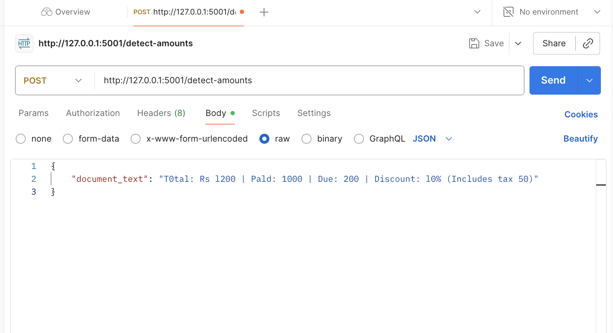
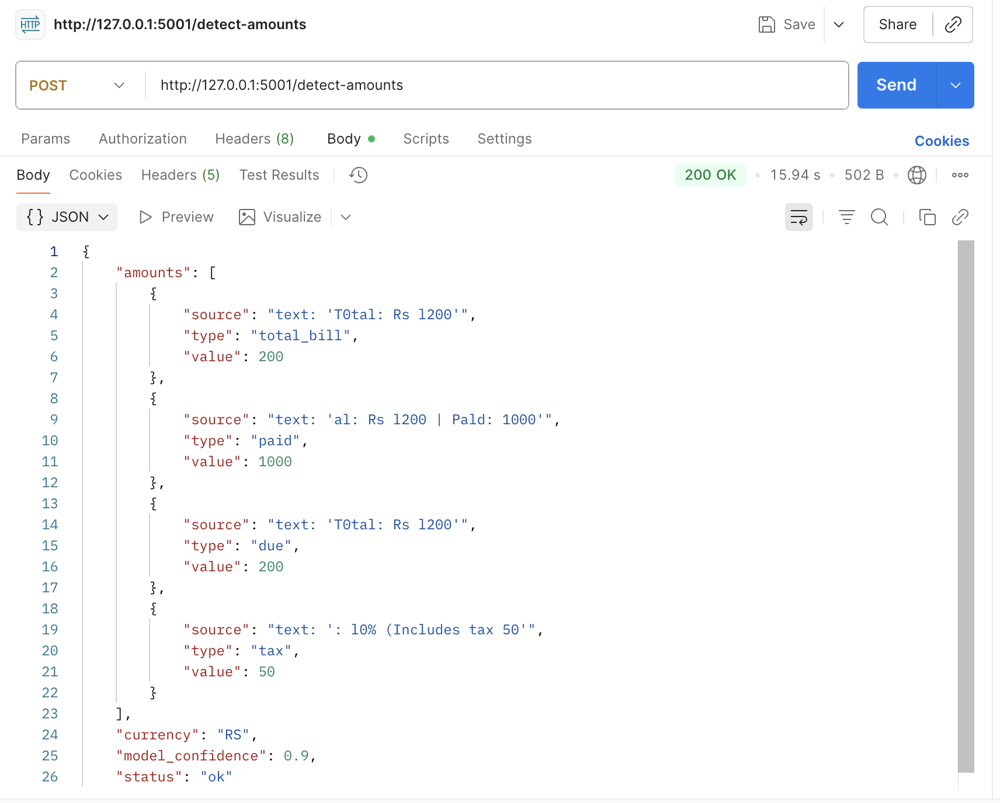

#  Amount Extractor Backend

##  Problem Statement
Design a backend service that extracts financial amounts from medical bills or receipts (typed or scanned, possibly crumpled or partially visible).  
The service must handle:
- OCR extraction from scanned documents/images.
- OCR error corrections & digit cleanup.
- Context classification (e.g., total_bill, amount_due, paid, discount).
- Return a structured JSON output with provenance (source line, context).

---

##  Features
-  REST API built with Flask
-  Supports text input and image input
-  Uses Tesseract OCR for image-to-text
-  Context-aware classification of amounts (via LLM or rule-based fallback)
-  JSON responses with confidence scores
-  Ready for integration with frontend or other microservices

---

##  Architecture
The system is designed as a modular pipeline with the following components:

### Input Layer
- Accepts either raw text (already extracted) or image files (scanned/photographed medical bills, receipts).  
- For images, OCR (e.g., pytesseract) extracts raw text.  

### Preprocessing Layer
- Cleans extracted text by removing noise, fixing common OCR errors (e.g., 1O → 10).  
- Tokenizes text into meaningful units (words + numbers).  

### Context Classification Layer
- Uses regex rules for detecting numeric patterns (₹1234.56, 1,234.00, etc.).  
- An AI/LLM model (Ollama/Mistral/GPT-based if available) analyzes the surrounding context to classify the financial amount.  
- Example categories: *Total Amount, Tax, Discount, Insurance Deduction, Other Charges.*

### Provenance Tracking
- Stores where the extracted amount came from (line number, raw text snippet).  
- Ensures traceability for debugging and audit.  

### Output Layer
- Produces a structured JSON response.  

---

## Example Run (Screenshots)
post http://127.0.0.1:5000/api/v1/extract/text
### Input (Medical Bill Screenshot)
Here is an example input image given to the service:  



---

### Output (Structured JSON Response 1)
When processed, the extracted amounts with context look like this:  




---

## API Usage

### Health Check
```bash
GET http://127.0.0.1:5000/health
